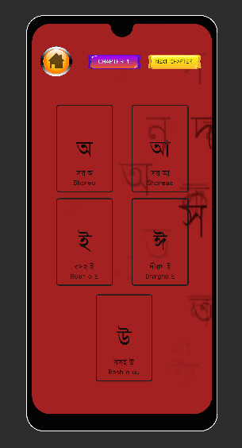

# Banglish
This Game is Based on learning Bangla from English in a fun way.  Developed in unity 3d URP.
This is still under development,this is a prototype work.

only support on android phones.

chapters--> tap on the letters to hear what it calls in Bangla and memorize it.

memorization test -->GO--> when the character is running tap multiple times left and right sides to move left and right. adjust the position with multiple taps. if you go through a Bangla letter/ number you are safe and will gain 1 point. if you touch an English letter/ number you will fail. 

this test will last 1 minute.  you can always try again.

Install instructions
download and install

Banglish.apk file. 
download link: https://haquei-x.itch.io/banglish

